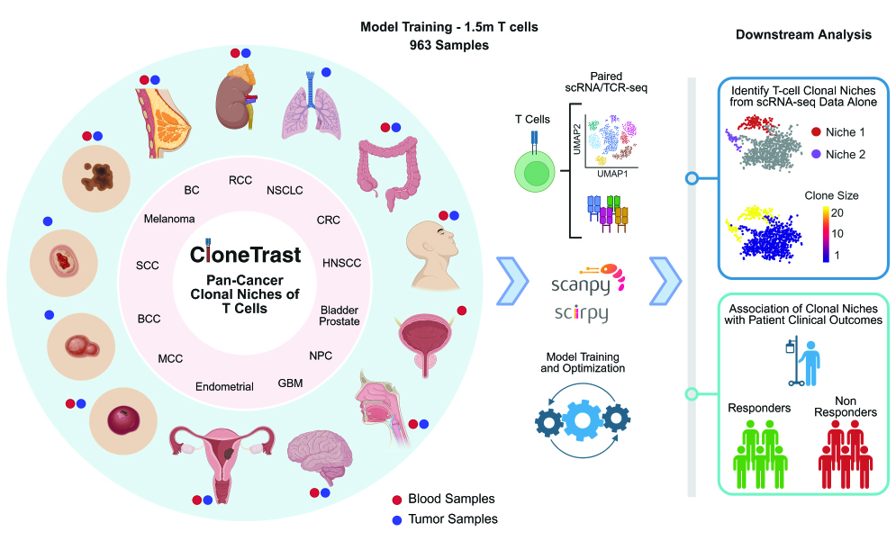
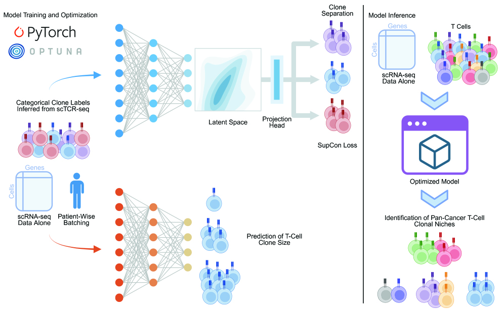

CloneTrast
==========

**Supervised contrastive learning for T-cell clonal architecture from single-cell RNA-seq.**

CloneTrast maps **gene expression alone** to a latent space where cells from the same T-cell clone cluster together.
At inference you only need scRNA-seq UMI counts, without paired scTCR-seq. The public **pre-trained model** (hosted on `Figshare <https://doi.org/10.6084/m9.figshare.32228991>`__) is downloaded automatically on first use, with an additional complementary model used to predict clone size from gene expression alone. You can then visualize your data with UMAP to explore clonal structure for downstream analysis.

Graphical description
---------------------

.. _clone-labels-vs-tcr:

Clone labels vs. TCR sequences
------------------------------

CloneTrast separates **how models are trained** from **how they are applied**. This distinction is central to what the embedding represents.

**During training: categorical clone labels - not TCR sequence identity**

Training requires a per-cell **'clone_id'** column: a **categorical label** that groups cells from the same T-cell clone. Those labels are **inferred from scTCR-seq rather than being actual TCR sequences** (please refer to our manuscript for more details). Thus, CloneTrast is **not** trained on TCR sequences. Supervision comes only from the **clone_id category**.

**At inference: scRNA-seq only - no scTCR-seq**

When you embed new cells (with the public pre-trained model), CloneTrast reads **gene expression only**. You do **not** need scTCR-seq, CDR3 sequences, or ``clone_id`` labels. The model maps each cell's transcriptome to a fixed-dimensional embedding (``X_clonetrast``).

**What this means for the embedding space**

During training, every cell with the same ``clone_id`` is a positive pair: the contrastive loss rewards them for being located next to each other. At inference, the encoder applies that learned mapping - **cells from the same clone are expected to cluster** in ``X_clonetrast`` when their expression reflects shared clonal identity.

This specific modeling approach results in a distinct embedding space capturing multiple components of clonal organization:

**(1) Different clones, similar functional states:** Two clones defined by different TCR sequences can be positioned near one another if they share similar functional status.

**(2) Same clone, divergent states:** T cells belonging to the same clone are pulled toward one another despite having diverse differentiation states due to intra-clonal transcriptional heterogeneity.

**(3) Same TCR sequence, different functional states:** Two clones with identical TCR sequences but distinct clonal identities, because they originate from different patients, can be positioned far apart if they exhibit different functional states.

Training and inference description
----------------------------------

.. toctree::
   :hidden:
   :maxdepth: 2

   user_guide
   tutorials
   api/index
   contributing

Installation
------------

See :doc:`installation` for installing from PyPI (pip/uv), optional GPU PyTorch, and development setup from source.

Quick start - inference
-----------------------

You only need **gene expression (scRNA-seq)**. Optional ``clone_id`` labels are for coloring plots or computing metrics only.

.. code-block:: python

   import scanpy as sc
   import clonetrast as ct

   # These are raw UMI counts
   adata = sc.read_h5ad("your_data.h5ad")

   # Raw counts should be subsequently normalized
   sc.pp.normalize_total(adata, target_sum = 1e4)
   sc.pp.log1p(adata)

   # Applying the contrastive model and creating a two-dimensional representation with UMAP
   ct.tl.embed(
      adata,
      use_pretrained=True          # default; downloads contrastive model on first run
   )
   ct.tl.compute_umap(adata, obsm_key="X_clonetrast", umap_key="X_umap_clonetrast")

   # Optional complementary model to predict log clone size per cell
   ct.tl.predict_clone_size(adata, use_pretrained=True)

   # Visualize
   sc.pl.embedding(adata, basis="umap_clonetrast", color=["predicted_clone_size"])

Embeddings are stored in ``adata.obsm['X_clonetrast']``; UMAP coordinates in ``adata.obsm['X_umap_clonetrast']``.

Predicted clone size is stored in `adata.obs['predicted_clone_size']`.

After the first run, models are cached under ``~/.cache/clonetrast/pretrained_models/``.

More detail: :doc:`workflow_inference`, :doc:`data_format`, :doc:`cli_reference`.

Training your own model (advanced) is covered in :doc:`workflow_train_embed`.

Citation
--------

Reference will be added here when available.

When describing the training objective, cite Khosla et al. (2020), *Supervised Contrastive Learning* (NeurIPS). See :doc:`contrastive_loss` for how CloneTrast implements Eqs. (2) and (3).
